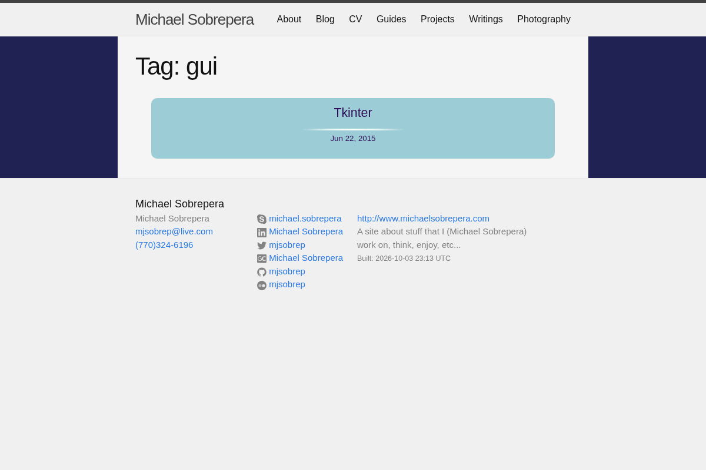
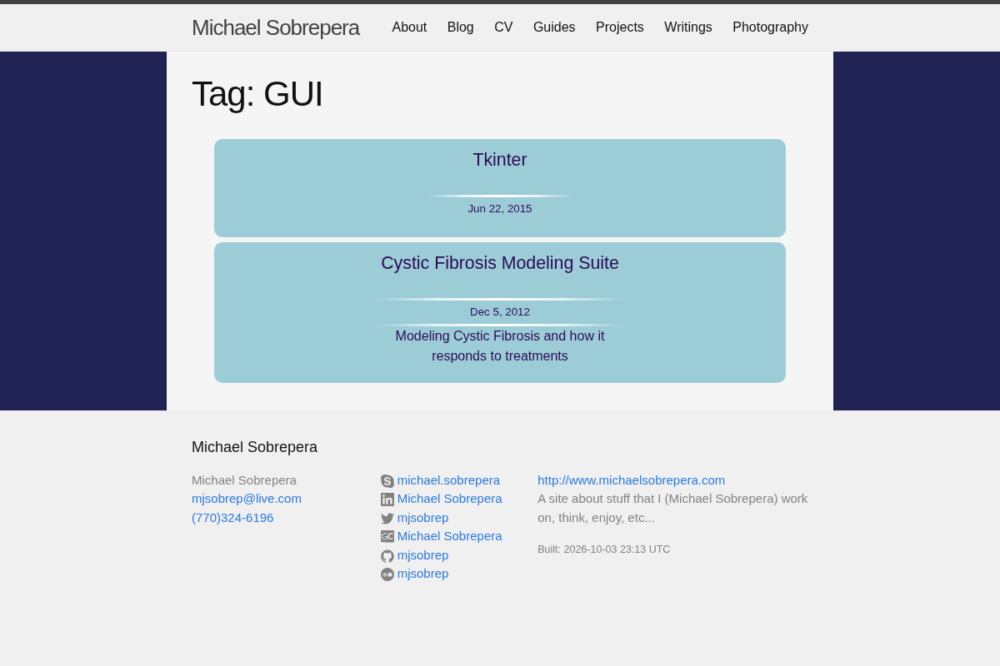
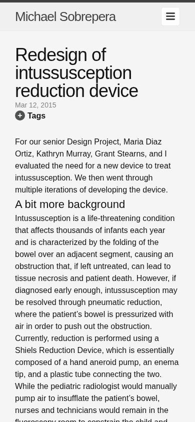
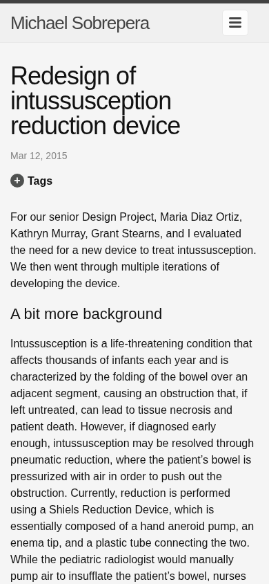
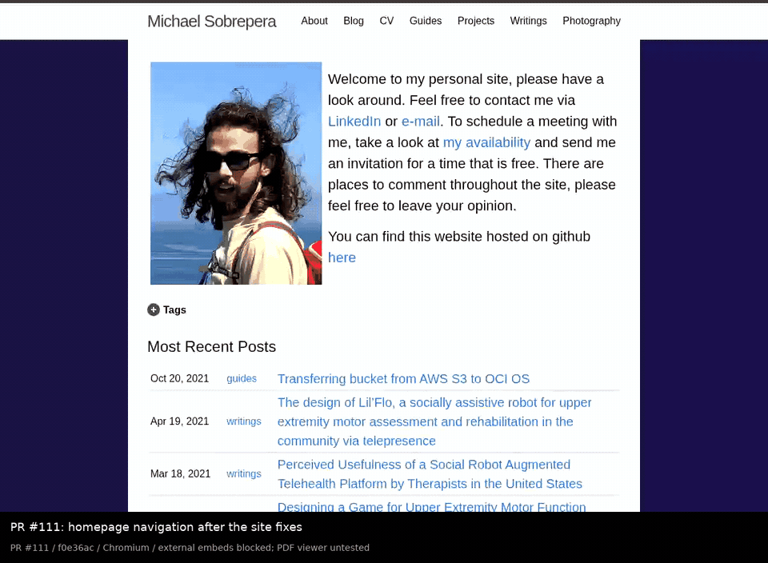
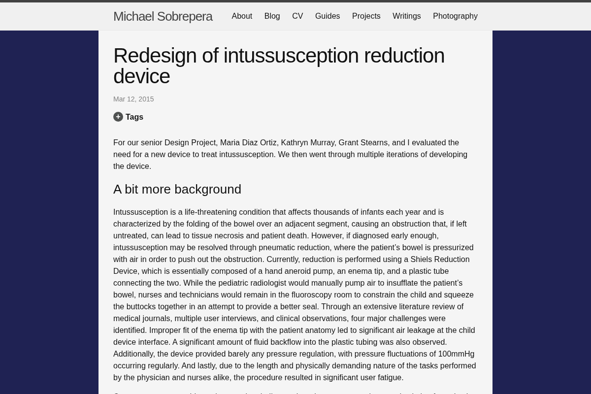
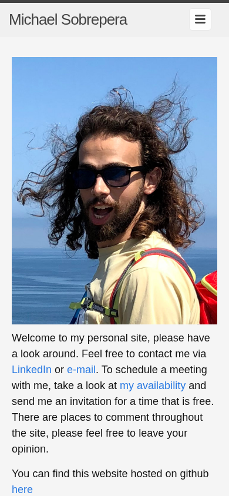
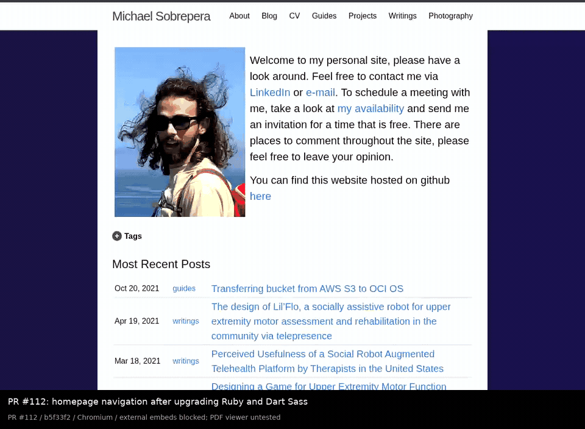

# PR review evidence

Actual Chromium screenshots and recordings for the open site-development PRs.

| Evidence | Before | After |
| --- | --- | --- |
| #111: site fixes | merged #110, `71b21c9406f815078df33ab13e558a5d27d2ee9c` | `f0e36ac3183358859d2b45a33b9d8dbca464cd60` |
| #112: runtime upgrade | #111, `f0e36ac3183358859d2b45a33b9d8dbca464cd60` | `b5f33f248c1cd76edb0b0e41a2009f5020e4708b` |

Each revision was built in its own directory from `git archive`, using its committed Gemfile and lockfile. #111 and its baseline used Ruby 3.2.2; #112 used Ruby 3.4.11 and Dart Sass. Desktop captures use 1200 × 800; mobile screenshots use 390 × 844. The recorded mobile step uses 390 × 800 inside the desktop video canvas.

## #111

The desktop GUI tag comparison shows the missing Cystic Fibrosis Modeling Suite post joining Tkinter on the canonical tag page. The mobile project comparison shows the corrected spacing.

| Before | After |
| --- | --- |
|  |  |
|  |  |

[Full-resolution MP4](pr111/demo.mp4)

## #112

The desktop project and mobile home screenshots are pixel-identical before and after the runtime upgrade. Their sampled computed layout and style values also match exactly.

| Before: Ruby 3.2.2 / LibSass | After: Ruby 3.4.11 / Dart Sass |
| --- | --- |
|  |  |
|  |  |

[Full-resolution MP4](pr112/demo.mp4)

## What the recordings verify

Both recordings navigate from the home page through Guides to Python, show the project page and verify its local PDF response, follow a legacy GUI tag URL to the canonical lowercase page, and finish at mobile width.

The browser assertions verify successful navigation, the Python page title, the real PDF response with a `%PDF-` signature, the original HTTP 404 followed by a JavaScript redirect, preservation of the query and fragment, both GUI/gui post cards, and no page JavaScript errors.

External images, scripts, videos, and presentation embeds were blocked consistently for all captures; their availability is not tested. Headless Chromium does not render the embedded PDF viewer in these captures. The PDF response is verified separately; viewer behavior is not tested.

The raw recordings come from Playwright's actual browser capture. FFmpeg only adds a caption band outside the original viewport and encodes MP4/GIF formats. `manifest.json` records source revisions, capture settings, assertions, timestamps, and media hashes. `capture.cjs` and `convert.py` are the capture and encoding scripts.

These assets are on a separate evidence branch, outside the source PRs and the published site.
